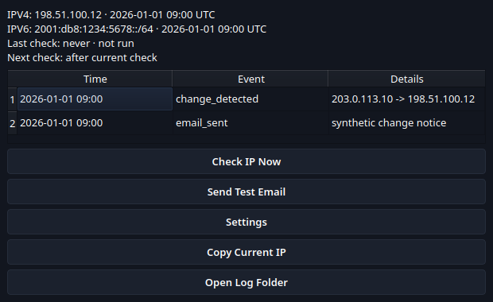
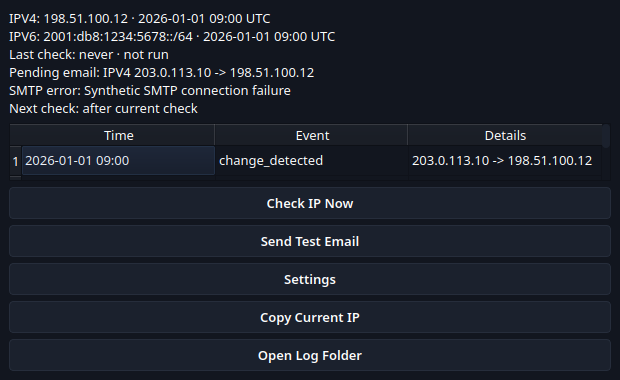
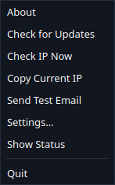
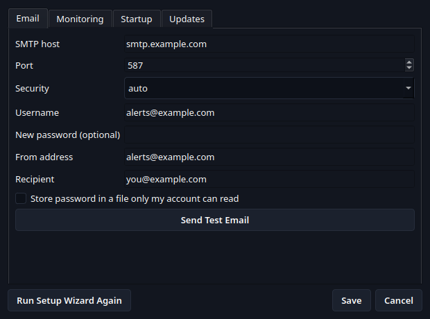

# ThunderWatch

ThunderWatch is a PyQt6 desktop app in the Storm Desktop Suite. It is being built to
watch a computer's public IPv4 address and IPv6 `/64` prefix and email a configured
recipient when two lookup providers confirm a change.

**This implementation is still in development and has not passed the hands-on
acceptance checks in [the design](docs/DESIGN.md#acceptance-checks). Do not rely on it
as an operational IP monitor yet.**

## Development

Requires Python 3.14 and Qt 6 development libraries on Linux.

```bash
make deps
make lint
make test
make run
```

Tests use synthetic provider responses and fake SMTP transports. They never contact
public IP services or SMTP servers.

## Current implementation

The repository includes the Qt-free lookup, confirmation, state, configuration,
secret-storage, and SMTP modules; an initial tray and setup UI; version selection and
verified updater download helpers; and the shared Storm Desktop Suite icon and theme.
The release workflows now build Windows and Linux packages and publish beta releases
after successful master builds. The first complete release run and hands-on Windows/Linux
package validation, package-specific update handoff checks, and network resume handling
are still outstanding.

## Screenshots

Screenshots come from the real Qt widgets with synthetic accounts and documentation
IP ranges. The generators do not contact IP providers, SMTP, or GitHub.











Follow the [setup wizard walkthrough](docs/SETUP_WIZARD.md). Regenerate the images with
`make screenshots` after UI changes.
