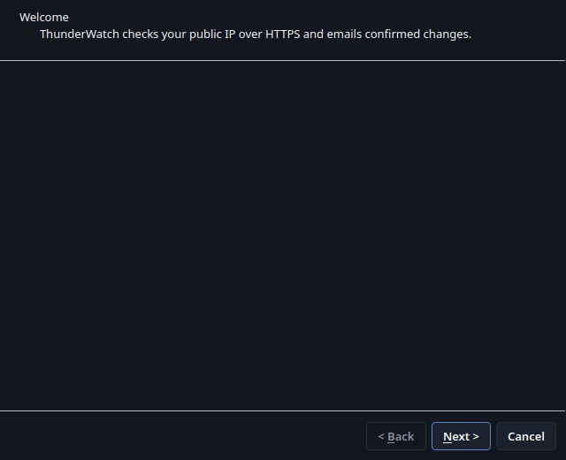
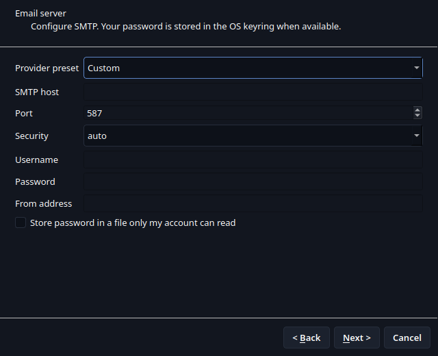
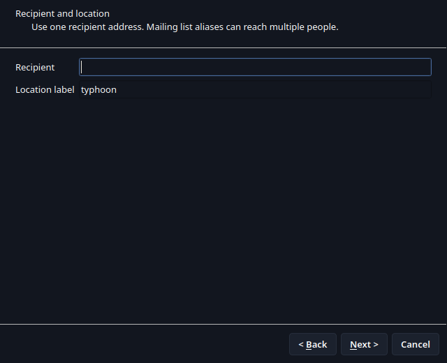
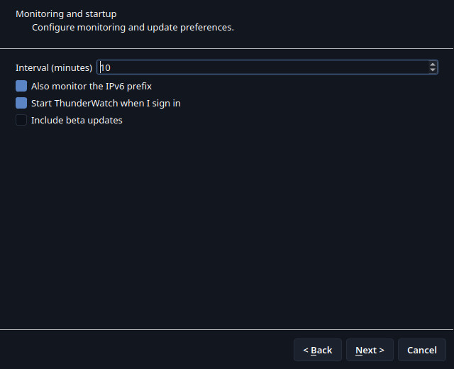
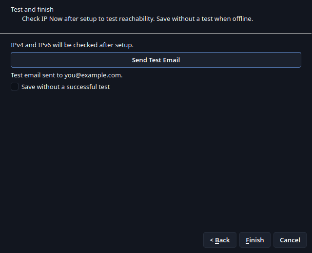

# ThunderWatch setup wizard

The wizard configures an SMTP account, one recipient, a location label, lookup interval,
IPv6 monitoring, start-at-sign-in, and beta-update preference. It contacts providers
only when **Send Test Email** is selected. The test email includes any current addresses
returned by the providers.

If an OS keyring is unavailable, ThunderWatch offers a password file only after the
owner-only storage checkbox is selected. A test email must succeed before setup can
finish, unless **Save without a successful test** is explicitly selected.
